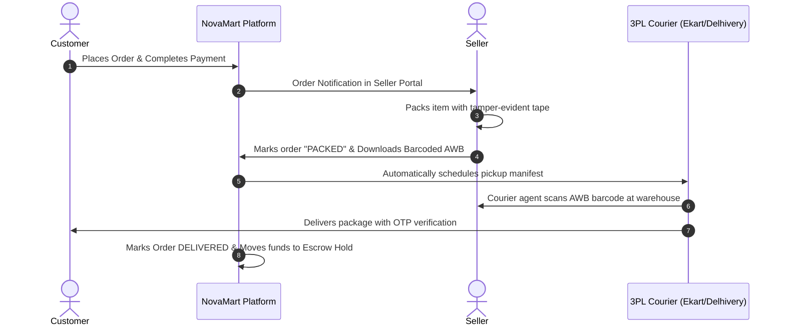

# NovaMart Merchant Seller Onboarding & Operations Guide

Welcome to the NovaMart Seller Hub! This manual guides merchants through registration, catalog listing, fulfillment standards, order processing, and escrow bank payouts.

---

## 1. Merchant Onboarding & Verification Checklist

To list products on NovaMart, merchants must provide the following verified documents:
1. **Valid 15-Digit GSTIN** (Goods & Services Tax Identification Number) registered in the pickup state.
2. **Business PAN Card** (Proprietorship, Partnership, LLP, or Private Limited).
3. **Active Current Bank Account Details** (Cancelled cheque / bank statement with matching IFSC code).
4. **Registered Pickup Warehouse Address** with valid 6-digit Indian PIN code.

---

## 2. Order Fulfillment & Dispatch Workflow

---

## 3. Financial Settlement Cycle & Payout Deductions

All seller payouts follow an automated **T+7 Days** schedule (calculated from the date of confirmed delivery to account for customer return policies):

$$\text{Net Seller Payout} = \text{Gross Order Amount} - \text{Marketplace Commission} - \text{18\% GST on Commission} - \text{1\% TCS} - \text{1\% TDS} - \text{Shipping Fee}$$

### Example Settlement Breakdown:
- **Product Selling Price**: ₹10,000.00
- **Marketplace Commission (8%)**: -₹800.00
- **18% GST on Commission**: -₹144.00
- **1% TCS**: -₹100.00
- **1% TDS (194-O)**: -₹100.00
- **Standard Logistics Fee**: -₹75.00
- **Net Bank Transfer (NEFT)**: **₹8,781.00**
